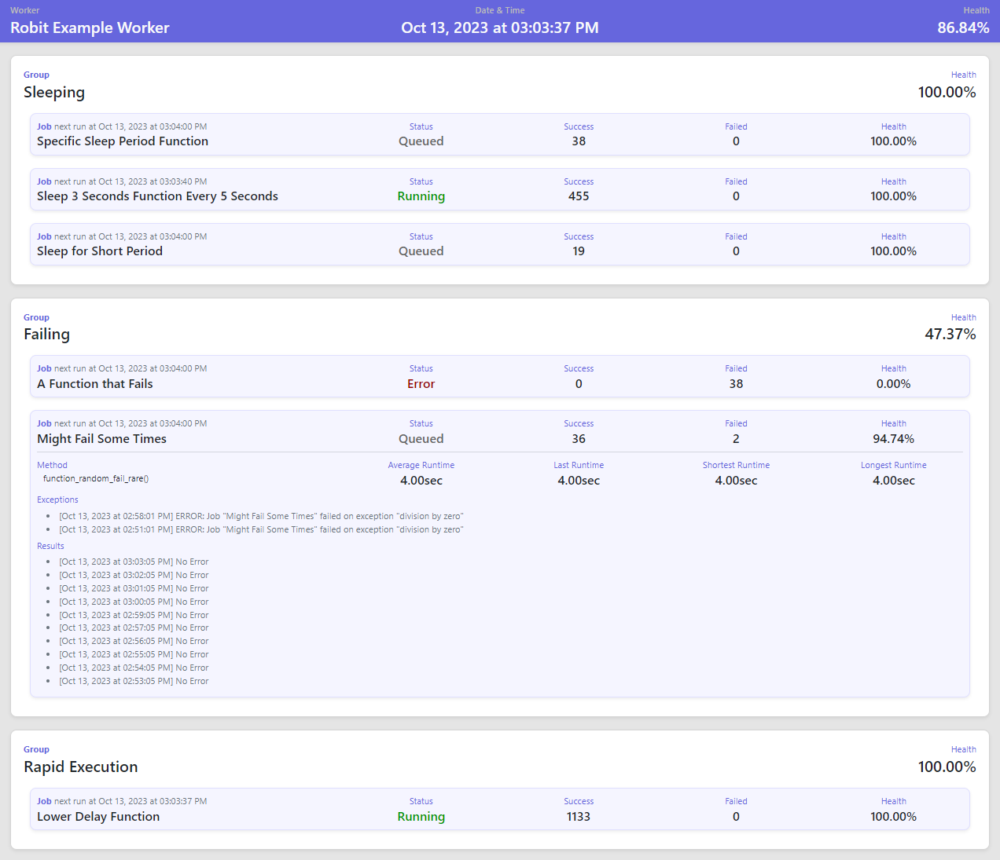

# Robit

Chronological Automation Service Framework

A robot for your bits! 

(Pronounced "Row-Bit")

## Features

- Lightweight (only one installed dependencies pytz which is also lightweight)
- Can run with monitoring interface or headless
- Very simple and easy to set up and configure 

### Interface



## Usage

### Worker

- Code below is provided in the examples/worker_example.py file of this project.

```python
import random
from time import sleep

import robit


robit.set_time_zone('America/Edmonton')
robit.set_database_logging(True)


def function_to_alert_me(**kwargs):
    print(f"ALARM !!!! {kwargs['alert_message']}")


wo = robit.Worker(
    name='Robit Example Worker',
    key='Your-Own-Unique-Worker-Key-That-Is-Secure',
    web_server=True,
    # web_server_address='0.0.0.0',
    # web_server_port=8000,
    alert_method=function_to_alert_me,
    alert_health_threshold=99.0,
)


def function_sleep_short():
    sleep(2)
    return 'Slept for 2 seconds'


def function_sleep_for_time(sleep_time: int):
    sleep(sleep_time)
    return f'Slept for {sleep_time} seconds'


wo.add_job(
    'Specific Sleep Period Function',
    function_sleep_for_time,
    method_kwargs={'sleep_time': 5},
    group='Sleeping',
    cron='* * * * *',
)

wo.add_job(
    'Sleep 3 Seconds Function Every 5 Seconds',
    function_sleep_for_time,
    method_kwargs={'sleep_time': 3},
    group='Sleeping',
    cron='*/5 * * * * *',
)

wo.add_job(
    'Sleep for Short Period',
    function_sleep_short,
    group='Sleeping',
    cron='*/2 * * * *',
)


def function_random_fail_often():
    if 3 <= random.randint(1,4):
        division_by_zero = 5 / 0
    sleep(4)
    return 'No Error'


def function_random_fail_rare():
    if 1 == random.randint(1,20):
        division_by_zero = 5 / 0
    sleep(4)
    return 'No Error'


wo.add_job(
    'A Function that Fails',
    function_random_fail_often,
    group='Failing',
    cron='*/10 * * * * *',
    retry_attempts=4,
)

wo.add_job(
    'Might Fail Some Times',
    function_random_fail_rare,
    group='Failing',
    cron='* * * * *',
)


def function_full_speed():
    x = int()
    for i in range(99999999):
        x = i * i
    sleep(1)
    return f'Max multiplication result of {x:,}'


wo.add_job(
    'Lower Delay Function',
    function_full_speed,
    group='Rapid Execution',
    cron='* * * * * *',
)


def function_send_worker_information(worker: robit.Worker):
    return f'Worker Success Count: {worker.success_count}'


wo.add_job('Send Worker Information', function_send_worker_information, group='Webhooks Or Database Update', cron='*/30 * * * * *')


if __name__ == '__main__':
    wo.start()
```

The server will start and host a web portal on default port 8100 locally for you to view what is going on.


## Other Libraries Used

- Boostrap (Responsive UI)
- Alpine (Better UX)
- PyTZ (Awesome Time Zone Management)


